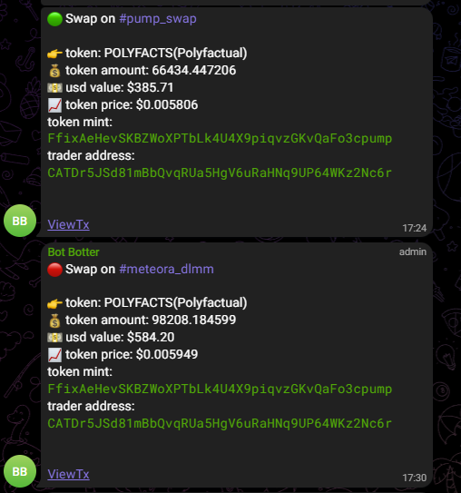
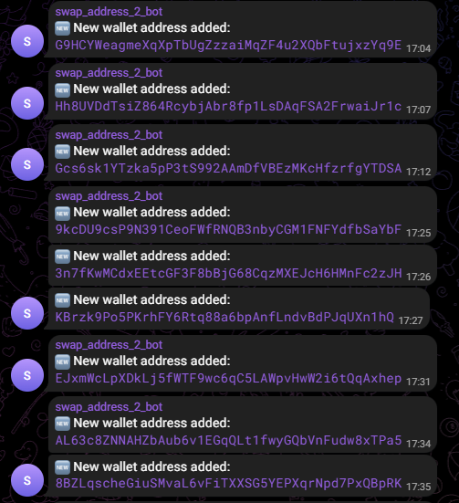

# Wallet Monitoring Bot

- This project is a Node.js-based Solana blockchain monitoring bot designed to detect and track large transfers of SOL and USDC tokens. It actively monitors specified Solana wallet addresses for significant outgoing or incoming transactions and automatically logs recipient addresses to a file named whales_address.txt. Simultaneously, the bot sends instant transaction notifications to a designated Telegram channel, enabling real-time alerts about substantial crypto movements.
- By integrating Solana’s Web3 APIs and using Telegram Bot APIs, this solution provides an efficient and automated way to monitor "whale" activities on the Solana blockchain, facilitating prompt responses and improved situational awareness for traders, analysts, or crypto enthusiasts.

---

## Let's Connect!,

<a href="mailto:traceyrun2@gmail.com" target="_blank">
  
</a>
<a href="https://t.me/David19922" target="_blank">
  
</a>
<a href="https://discord.com/users/bold0163" target="_blank">
  
</a>

---

## Features

- 🔍 **Real-time Monitoring**: Monitors specified Solana addresses for outgoing transfers
- 💰 **USD Threshold Filtering**: Only triggers on transfers above a configurable USD amount
- 🐋 **Whale Detection**: Automatically saves recipient addresses to `whales_address.txt`
- 📱 **Telegram Notifications**: Sends real-time notifications for large transfers
- 🚫 **DEX Filtering**: Excludes DEX transactions, only detects pure transfers
- 📊 **SOL Price Integration**: Fetches real-time SOL prices for accurate USD calculations

## Purpose
The purpose of this project is to provide an advanced blockchain monitoring solution that identifies golden opportunities for substantial profit by analyzing large Solana token transfers and tracking subsequent swap activities involving the recipient addresses. By combining real-time monitoring of major transactions with detailed scrutiny of token swaps, this system aims to detect high-potential profit chances efficiently. Instant Telegram notifications enable timely alerts so traders and analysts can make informed decisions quickly, optimizing profit-taking strategies in the dynamic and fast-paced Solana decentralized finance ecosystem.

## Configuration

Edit the `.env` file with your configuration:

```env
# Telegram Configuration
TELEGRAM_BOT_TOKEN=your_bot_token_here
TELEGRAM_CHAT_ID=your_chat_id_here

# Transfer Monitoring Configuration
MIN_TRANSFER_USD=4000
MONITORED_ADDRESSES=address1,address2,address3

# WebSocket Configuration
HELIUS_API_KEY=your_helius_api_key
```

### Configuration Options

- `TELEGRAM_BOT_TOKEN`: Your Telegram bot token
- `TELEGRAM_CHAT_ID`: Your Telegram chat ID for notifications
- `MIN_TRANSFER_USD`: Minimum transfer amount in USD to trigger notifications (default: 4000)
- `MONITORED_ADDRESSES`: Comma-separated list of Solana addresses to monitor
- `HELIUS_API_KEY`: Your Helius API key for WebSocket connection

## Usage

1. Configure your `.env` file
2. Run the application:
   ```bash
   npm start
   ```

3. The application will:
   - Connect to Helius WebSocket
   - Monitor the specified addresses
   - Detect large transfers (above USD threshold)
   - Save recipient addresses to `../whales_address.txt`
   - Send Telegram notifications

## How It Works

1. **Transfer Detection**: The application uses program ID analysis to distinguish between transfers and DEX transactions
2. **Amount Calculation**: Calculates transfer amounts in SOL and converts to USD using real-time prices
3. **Threshold Filtering**: Only processes transfers above the configured USD threshold
4. **Whale Saving**: Automatically saves recipient addresses to the whales file
5. **Swap detection** : monitoring the saved address and detect the sawp, send notification
6. **Notifications**: Sends detailed Telegram notifications with transaction links

## Transfer Classification

The application classifies transactions as transfers when:
- The transaction involves the System Program (11111111111111111111111111111111)
- No DEX program IDs are present in the transaction logs
- The transaction represents a direct SOL transfer between addresses

## Telegram Notifications

Each notification includes:
- Transfer amount in SOL and USD
- Sender and recipient addresses
- Transaction signature with Solscan link
- Slot number
- Whether it's a new whale address




## Error Handling

- Automatic reconnection on WebSocket disconnection
- Duplicate transaction filtering
- Comprehensive error logging
- Graceful shutdown handling

## Requirements

- Node.js 14+
- Valid Helius API key
- Valid Telegram bot token and chat ID
- Internet connection for real-time monitoring

---

## 📞 Contact Information
For questions, feedback, or collaboration opportunities, feel free to reach out:

📱 **Telegram**: [@A5-](https://t.me/@David19922)  
---
